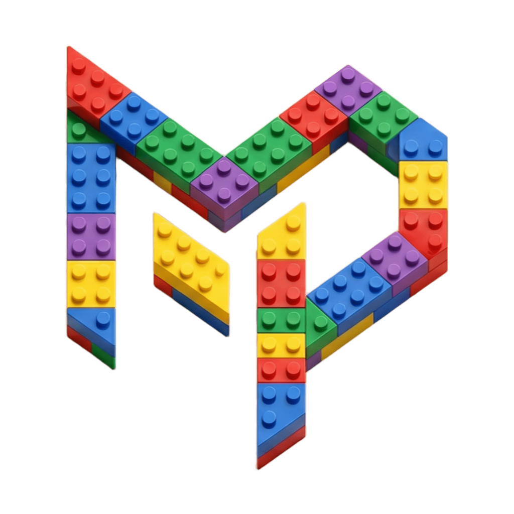
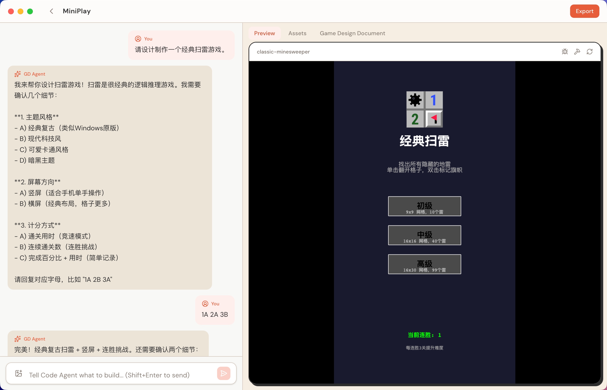

<p align="center">
  
</p>

<h1 align="center">MiniPlay</h1>

<p align="center">
  <strong>Turn your ideas into WeChat Mini Games</strong><br/>
  Imagine · Create · Play · Earn
</p>

<p align="center">
  <a href="https://github.com/agioracle/MiniPlay/releases/latest">
    
  </a>
  <a href="https://github.com/agioracle/MiniPlay/releases/latest">
    
  </a>
  <a href="https://github.com/agioracle/MiniPlay/blob/main/LICENSE">
    
  </a>
</p>

---

MiniPlay is an AI-powered desktop application that generates playable WeChat mini-games from natural language descriptions. Describe your game idea in a chat conversation, and MiniPlay's AI agents will design, code, preview, and package it — all without writing a single line of code.



## How It Works

MiniPlay uses a two-phase AI agent architecture:

1. **GD Agent (Game Designer)** — An LLM-powered agent that interviews you about your game idea, asks clarifying questions, and produces a structured Game Design Document (GDD).

2. **Code Agent** — A CLI-based coding agent (Claude Code, Codex, Gemini CLI, or OpenCode) that reads the GDD and generates a complete Phaser 3 game project with scenes, entities, assets, and configuration.

The generated game runs in a live preview inside MiniPlay. If runtime errors occur, a self-healing pipeline automatically captures them and sends fixes to the Code Agent.

## Features

- **Natural language to game** — Describe your game idea in plain language, get a playable game
- **Live preview** — See your game running in real-time as it's being built
- **Image attachments** — Upload reference images to guide the design
- **Self-healing** — Runtime errors are automatically captured and fixed
- **Asset management** — Browse, add, replace, move, and delete game assets
- **GDD editor** — View and edit the Game Design Document directly
- **Version history** — Git-based time travel to previous versions
- **Export** — Package as a WeChat mini-game (.zip) with AppID and CDN configuration
- **Multiple Code Agents** — Choose from Claude Code, Codex, Gemini CLI, or OpenCode
- **Cross-platform** — macOS (Apple Silicon + Intel) and Windows

## Getting Started

### Download

Download the latest release for your platform from the [Releases](https://github.com/agioracle/MiniPlay/releases/latest) page:

| Platform | File |
|----------|------|
| macOS (Apple Silicon) | `MiniPlay-x.x.x-mac-arm64.dmg` |
| macOS (Intel) | `MiniPlay-x.x.x-mac-x64.dmg` |
| Windows | `MiniPlay-x.x.x-win-x64.exe` |

### First Launch

1. Open MiniPlay — the Setup Wizard will automatically detect and install required dependencies
2. Configure your LLM API endpoint, API key, and model (or skip to configure later in Settings)
3. Click **Get Started** to enter the home screen

### Prerequisites

MiniPlay requires at least one Code Agent CLI installed on your system:

| Agent | Install | Instructions |
|-------|---------|--------------|
| **Claude Code** (recommended) | `curl -fsSL https://claude.ai/install.sh \| bash` | https://docs.anthropic.com/en/docs/claude-code |
| **Codex** | `npm install -g @openai/codex` |  https://github.com/openai/codex |
| **Gemini CLI** | `npm install -g @google/gemini-cli` | https://github.com/google-gemini/gemini-cli |
| **OpenCode** | `npm i -g opencode-ai` | https://opencode.ai |

Node.js (>= 18) and the phaser-wx toolchain are automatically installed by MiniPlay if not present.

## Development

### Setup

```bash
git clone https://github.com/agioracle/MiniPlay.git
cd MiniPlay
npm install
```

### Run in Development Mode

```bash
npm run dev
```

This starts Next.js dev server, TypeScript watcher, and Electron concurrently.

### Build

```bash
# Build Next.js + Electron TypeScript
npm run build

# Package macOS DMG
npm run dist

# Package Windows installer
npm run dist:win

# Package all platforms
npm run dist:all
```

### Project Structure

```
MiniPlay/
├── electron/               # Electron main process
│   ├── main.ts             # App entry, window creation, menu
│   ├── preload.ts          # IPC bridge to renderer
│   ├── ipc/                # IPC handlers (agent, coder, project, assets, export, etc.)
│   ├── agent/              # GD Agent (LLM) + tools
│   ├── coder/              # Code Agent runner + session management
│   ├── process/            # Build manager, preview server, self-heal, error parser
│   ├── project/            # Project scaffold, GDD, state
│   ├── hydration/          # Environment detection + auto-install
│   ├── export/             # WeChat build, zip, size check
│   └── storage/            # Config, paths, project index
├── src/                    # Next.js renderer (React)
│   ├── app/                # Pages and global styles
│   └── components/         # UI components
├── build/                  # App icons and macOS entitlements
└── .github/workflows/      # CI/CD release automation
```

### Tech Stack

- **Electron** — Desktop shell
- **Next.js** (SSG) — Renderer UI framework
- **Tailwind CSS v4** — Styling with custom warm theme
- **Vercel AI SDK v6** — LLM streaming and tool calling
- **Phaser 3** — Game engine (via [phaserjs-webgl-transform](https://github.com/agioracle/phaserjs-webgl-transform) toolchain)
- **Motion** — Animations (wave dots background, hero section)

## Release

Releases are automated via GitHub Actions. Push a version tag to trigger builds:

```bash
git tag v0.2.0
git push --tags
```

The workflow builds macOS DMG (arm64 + x64), macOS ZIP, and Windows NSIS installer, then publishes them as GitHub Release assets.

## License

[MIT](LICENSE)
